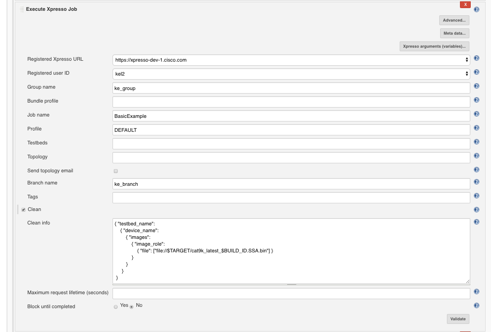

# Support QA image copy dynamically

This section provides an example that images are automatically copied from a known location where nightly builds are done to a given location that is needed by the sanity that is being executed by XPRESSO on Jenkins. There are many ways to achieve this on Jenkins, users can use the below mechanism template to customize their own solutions.

## Step 1: create a project with parameters
* create a free style project (similar way if user use Pipline or Build Flow project)
* configure 3 'String' parameters:
    - IMAGE_PATH (source image nightly build folder, for example Cisco automount locaiton)
    - IMAGE_NAME (image name, support regx pattern)
    - TARGET (image copied destination, can be another Cisco automount location or typical local Jenkins workspace)

## Step 2 schedule the run:
Configure the job to run each day at 2 AM. User can set his own schedule by using cron syntax.

## Step 3 add a build step to copy the image:
There are many ways to copy image files from one location to another in Jenkins, most need special setup or some third party plugins, for example 'file operations': https://wiki.jenkins.io/display/JENKINS/File+Operations+Plugin

In case the user has Cisco EngIT managed Jenkins, which installing plugins and configuring system settings can be limitations. Here we use native Jenkins shell command to achieve the requirements. Add build step: Execute shell

Check the comments in the following code, and customize the commands as users' requirements.

    # find the latest image folder created from the nightly builds
    LATEST_IMAGE_FOLDER=$(ls -td $IMAGE_PATH/*/ | head -1)

    # build the latest image source path
    LEN=${#LATEST_IMAGE_FOLDER}
    LATEST_IMAGE_FOLDER=${LATEST_IMAGE_FOLDER::LEN-1}
    FINAL_IMAGE_PATH=$LATEST_IMAGE_FOLDER/$IMAGE_NAME

    # make sure there is a target image we want to copy and test, sometimes if build failed, empty folder created
    if ls $FINAL_IMAGE_PATH 1> /dev/null 2>&1; then
        echo "files do exist"
        # copy the image from source to destination defined in $TARGET, rename it to a unique known to the next build step
        # if want to copy the image to local Jenkins. instead of $TARGET, use $WORKSPACE 
        cp $FINAL_IMAGE_PATH $TARGET/cat9k_latest_$BUILD_ID.SSA.bin
    else
        # no image found, exit the curent build 
        echo "Image directory is empty! Aborting the build, and see you tomorrow :)"
        exit 1
    fi

## Step 4 trigger the xpresso build using the image:
After the previous step, the image file should be copied to the location the executor Jenkins be able to access.

Assume the job have already properly registered on the Xpresso already.

Add build step: Execute Xpresso Job. Specify the image info with Json format in the "clean info" section.

