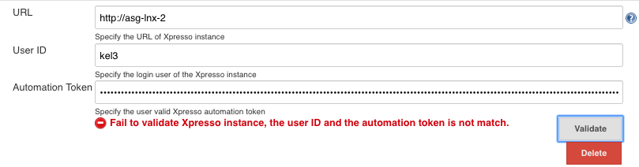
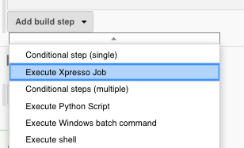
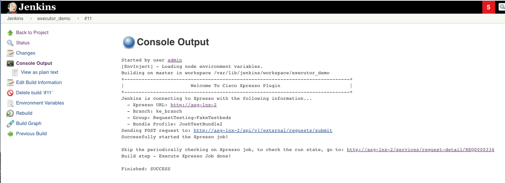

# Quick Start

## System Configuration
To call Xpresso jobs as part of the build step workflow, the Xpresso instances details needs to be registered and validated.

Follow the steps below to register the Xpresso instance(s), and to validated its interface with Jenkins.

### Step 1:
Navigate to "Manage Jenkins" and choose "Configure System"

### Step 2:
In __Xpresso Servers Registration__ section click the "Add" button.

### Step 3:
Register the Xpresso Instance, the user ID, and the user's REST API Authentication Token in Jenkins. The Xpresso Plugin uses the token-based authorization mechanism to verify the Xpresso Instances. The information can be found in the given Xpresso instance -> My Profile -> Token -> Automation Token. 

`Note:  "Automation Token" is the value of the token only, exclude any prefix (ie: Jwt). The token will be hidden with ****** for security purpose as the picture shown in Step 4.`
 

### Step 4:
Validate the interface between Jenkins to the configured Xpresso Instance. Once required information is completed,  click the "validate" button.

Possible validation messages are:
* Successful validation: `OK`
* Missing required info: `Required: URL, user ID and automation token.`
* Wrong format: Error: `Invalid automation token format. Remove the token frefix: Jwt`
* Invalid token: `Fail to validate Xpresso instance with provided information. Make sure the automation token is valid!`
* User name does not match its token: `Fail to validate Xpresso instance, the user ID and the automation token is not match.`
* Server connection issue: `Fail to validate Xpresso instance with provided information. Connect to xxx failed: Connection refused (Connection refused)`
* Any other issues from Xpresso:
  * `fail to validate Xpresso instance, make sure Xpresso URL matches user with valid token. Unexpected response from Xpresso - 404: Not Found`
  * `fail to validate Xpresso instance, make sure Xpresso URL matches user with valid token. Unexpected response from Xpresso - 401: Unauthorized`

## Build Configuration
Add Execute Xpresso Job build step into the automation pipeline.

### Step 1:
Navigate to the Jenkins project and select "configure".

### Step 2:
From the "Add build step"  select  __Execute Xpresso Job__. This can be repeated to add one or more Xpresso Job to the build step. 

### Step 3:
Provide the information about the Xpresso job to be executed.   

* Complete the mandatory information such as: "Xpresso URL", "User ID", "Group name", and  "Branch name".
* "Job name" and "profile" are mandatory when no "Bundle profile" has been specified. If "Bundle profile" is provided, do not specify the following fields: "Job name", "Profile", "Testbeds", "Topology".
* The "Testbeds" and "Topology" are optional, if not been provided the default values configured in Xpresso will be used. "Testbeds" and "Topology" are mutually exclusive, only one can be provided.
* "Send topology email" is optional. To send topology email, "Topology" field has to be specified.
* The "Max Request Lifetime" is the maximum duration for the Request to get Completed until it is stopped.  
* Select the "Block until completed" to block running the next build step until the current build step is completed. The status of the current build step is checked periodically (every 2 minutes). The Xpresso job status URL will be provided on the console. 
 

### Step 4:
Validate the information about the job. Once required information is completed,  click the "validate" button.
  
Possible validation messages are:
* Successful validation: `Validation OK`
* Missing required info: `Required: Xpresso URL, User ID, Group name, Job name, Profile, Branch name`
* Wrong info:
  * `Fail to validate Xpresso "group" info from the entered group name - xxx Unexpected response from Xpresso - 404:Not Found`
  * `Fail to validate Xpresso "job" info from the entered job name - xxx Unexpected response from Xpresso - 404:Not Found`
  * `Fail to validate Xpresso "profile" info from the entered profile name - xxx Unexpected response from Xpresso - 404:Not Found`
  * `Fail to validate Xpresso "testbeds" info from the entered testbed name - xxx Unexpected response from Xpresso - 404:Not Found`
  * `Fail to validate Xpresso "topology" info from the entered topology name - xxx Unexpected response from Xpresso - 404:Not Found`
  * `Fail to validate Xpresso "branch" info from the entered branch name - xxx Unexpected response from Xpresso - 404:Not Found`
  * `Fail to validate Xpresso "bundle profile" info from the entered bundle name - xxx Unexpected response from Xpresso - 404:Not Found`
* Wrong input: `Failed - configure either testbeds or topology, but NOT both at the same time!`
* Server connection issue: `Connect to xxx failed: Connection refused (Connection refused)`
* Any other issues from Xpresso: `Fail to validate Xpresso. Unexpected response from Xpresso - 401: Unauthorized`

## Execution and Output

To execute the job, click "Build Now" on the project page.

Example of output when the "Block until completed" option disabled:

Example of output when the "Block until completed" option enabled:

